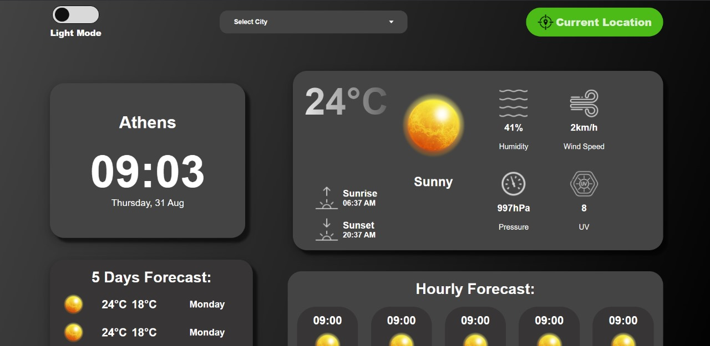

# Weather App



This is a weather application that provides current weather information, forecasts, and other weather-related data.

## Project Structure

## Installation

1. Clone the repository:

    ```sh
    git clone <repository-url>
    ```
2. Navigate to the project directory:
    ```sh
    cd weather-app
    ```
3. Install the dependencies:
    ```sh
    npm install
    ```

## Usage

### Development Server

To start the development server, run:
```sh
npm run dev
```

### Build

To build the project for production, run:
```sh
npm run build
```

### Preview

To preview the production build, run:
```sh
npm run preview
```

## File Descriptions

- `main.js`: Main JavaScript file that initializes the application and handles DOM manipulation.
- `package.json`: Contains project metadata and dependencies.
- `style.css`: Main CSS file that imports various SCSS styles.
- `src/fetchData.js`: Contains functions to fetch weather data from APIs.
- `src/helperFunctions.js`: Contains utility functions used throughout the application.
- `public/data/weatherDescription.json`: JSON file containing weather descriptions.
- `public/WeatherImages/`: Directory containing weather-related images.
- `src/styles/`: Directory containing SCSS styles organized by base, component, layout, and mixins.

## Dependencies

- `axios`: Promise-based HTTP client for the browser and Node.js.
- `colorjs.io`: Library for color manipulation.
- `vite`: Next-generation frontend tooling.
- `esbuild`: An extremely fast JavaScript bundler.
- `sass-embedded`: Embedded Sass implementation.
